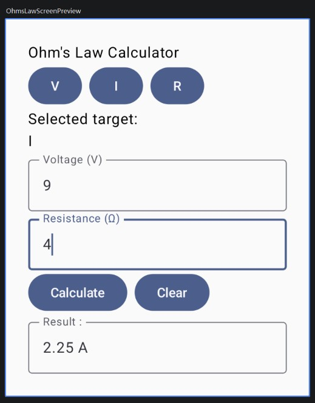

# Ohm's Law Calculator

## 日本語

### 制作目的

電気回路で学んだオームの法則を題材に、KotlinとJetpack Composeの基礎を学ぶため、本アプリを制作した。

### 現在の状態

**2026/09/28**

計算機能と画面を実装し、基本機能が完成した。  
単体テストおよびプロジェクト全体のビルドが成功することを確認した。

### 実装済みの機能

1. オームの法則を使用した電圧・電流・抵抗の計算
2. 入力内容に誤りがある場合のエラーメッセージ表示
3. 0で割ろうとした場合のエラーメッセージ表示
4. 入力値・計算対象・計算結果のクリア
5. 電圧・電流・抵抗の計算関数に対する単体テスト

### 使用技術

1. Kotlin
2. Jetpack Compose
3. Android Studio

### 参考資料

1. [初めてのAndroidアプリを作成する](https://developer.android.com/codelabs/basic-android-kotlin-compose-first-app?hl=ja#0)

## English

### Purpose

I created this app to learn the basics of Kotlin and Jetpack Compose using Ohm's law, which I studied in electrical circuits.

### Current Status

**2026/09/28**

The calculation features and user interface have been implemented, and the basic functions are complete.  
All unit tests pass, and the project builds successfully.

### Implemented Features

1. Calculation of voltage, current, and resistance using Ohm's law
2. Error messages for invalid input
3. An error message when attempting to divide by zero
4. Clearing the input values, selected calculation target, and result
5. Unit tests for the voltage, current, and resistance calculation functions

### Technologies

1. Kotlin
2. Jetpack Compose
3. Android Studio

### References

1. [Create your first Android app](https://developer.android.com/codelabs/basic-android-kotlin-compose-first-app#0)

## 中文

### 制作目的

为了学习 Kotlin 和 Jetpack Compose 的基础知识，我以电路课程中学过的欧姆定律为主题，制作了这款计算器应用。

### 当前状态

**2026/09/28**

计算功能和用户界面已经完成。  
所有单元测试均已通过，整个项目也已成功构建。

### 已实现的功能

1. 使用欧姆定律计算电压、电流和电阻
2. 输入内容有误时显示错误信息
3. 除数为零时显示错误信息
4. 清除输入值、所选计算目标和计算结果
5. 对电压、电流和电阻的计算函数进行单元测试

### 使用技术

1. Kotlin
2. Jetpack Compose
3. Android Studio

### 参考资料

1. [创建您的首个 Android 应用](https://developer.android.com/codelabs/basic-android-kotlin-compose-first-app?hl=zh-cn#0)